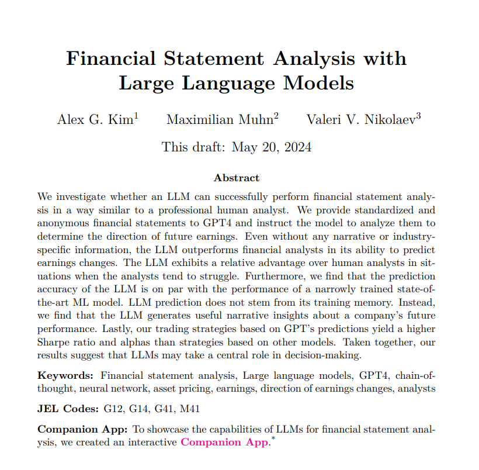

# English
# Financial Statement Analysis with Large Language Models

This study explores the potential of Large Language Models (LLMs) in analyzing financial statements and predicting future earnings. It compares LLM performance with human analysts and state-of-the-art (SOTA) machine learning (ML) models, examining the broader implications for the future of financial analysis.

## The Role of Financial Statement Analysis (FSA)
The paper emphasizes the crucial role of Financial Statement Analysis (FSA) in financial markets, especially for guiding investment decisions. Predicting a firm’s earnings is one of the primary goals of FSA, as it influences stock market recommendations and provides essential insights for investors.

FSA also requires detailed, nuanced analysis—often involving complex calculations of financial ratios and consideration of broad contextual factors, including soft information, industry knowledge, and various regulatory, political, and macroeconomic influences. Machines typically struggle with such comprehensive context.

## Target
The main objective of this study is to predict a binary change in future earnings: increase or decrease.

## Dataset
The dataset used was anonymized by removing firm names and years, preventing the LLM from accessing prior knowledge embedded in its training data. This ensures the model relies only on the provided information without any pre-existing historical data.

## Prompt Techniques
The study evaluates the LLM using two distinct prompting techniques:

- **Standard Prompt**: Asks the model to calculate key financial ratios and forecast earnings direction.
- **Chain of Thought (CoT) Prompt**: A prompt that mirrors the reasoning process of a financial analyst, guiding the model through the ratios' formulas, computations, and the insights these ratios provide.

No additional fine-tuning or pre-training was applied.

## Evaluation and Results
The model's predictions were compared to those of a naive model, financial analysts (offering projections at various intervals post-financial statement releases), and other ML models like logistic regression and Artificial Neural Networks (ANN).

- **GPT-4-Turbo** demonstrated impressive results using CoT prompts, achieving 60.31% accuracy, outperforming analysts who scored 53% accuracy one month post-earnings release.
- GPT-4-Turbo’s accuracy was comparable to ANN (60.45%) and significantly better than logistic regression, which achieved 52.94%.

## Will LLMs Replace Analysts?
The findings indicate that GPT-4's predictions outperform human analysts, especially when human judgment is subject to bias or inefficiency.

While LLMs excel, especially when analysts face challenges, they can still complement rather than replace human judgment in complex financial analyses. Notably, GPT-4 had limited success with smaller firms or firms that reported losses, where analysts’ expertise proved valuable.

## Comparing LLMs to SOTA ML Models
The study underscores LLMs' strong accuracy compared to SOTA ML models, such as ANN. One advantage of LLMs is their training on vast general knowledge, including business cases, financial theories, and economic contexts. This diverse foundation allows LLMs to make sense of new patterns, which is essential in financial analysis.

## Understanding LLM Predictive Ability
### Hypothesis 1
The LLM might outperform due to a look-ahead bias, using underlying knowledge from pre-training. However, anonymizing data—removing firm names, standardizing years as terms like t and t-1—eliminates this bias.

Despite this, could the LLM guess the firm’s name? A study found the LLM struggled with accuracy in guessing names, often defaulting to high-profile guesses like Facebook or Google.

### Hypothesis 2: Narrative as Insight
After calculating financial ratios and using CoT prompts, the LLM generates insights that guide its earnings predictions.

To validate this, the authors encoded LLM-generated narratives into 768-dimensional vectors using BERT and trained an ANN, which achieved 59% accuracy—close to GPT’s 60%. The similarity, with a 94% correlation between GPT's and ANN's predictions, suggests that LLM-generated narratives are informative predictors of future performance.

**Link to Paper**: [https://papers.ssrn.com/sol3/papers.cfm?abstract_id=4835311](https://papers.ssrn.com/sol3/papers.cfm?abstract_id=4835311)

# Türkçe
# Büyük Dil Modelleri ile Finansal Tablo Analizi

Bu çalışma, LLM'lerin (Büyük Dil Modelleri) finansal tabloları etkili bir şekilde analiz edip gelecekteki kazançları tahmin edebilme potansiyelini araştırarak, performanslarını insan analistler ve SOTA (en güncel) makine öğrenimi modelleri ile karşılaştırmayı ve finansal analiz için gelecek potansiyelini değerlendirmeyi amaçlamaktadır.

## FSA
Makale, finansal piyasalarda bilinçli karar alma süreci için Finansal Tablo Analizi'nin (FSA) önemini vurguluyor: FSA'nın en önemli amaçlarından biri, bir firmanın kazançlarını tahmin etmektir. Bu, hem borsa tavsiyeleri için bir girdi olarak hem de yatırımcıları bilgilendiren bir çıktı olarak hizmet eder.

Bu tür analizlerin insan açısından karmaşıklığını da açıklıyor, çünkü finansal oranların hesaplanması ve geniş bir bağlamsal anlayış gerektirir. Bu bağlam, yumuşak bilgileri, sektör bilgilerini, düzenleyici, politik ve makroekonomik faktörleri de kapsar—ki bu, makinelerin genellikle yapamayacağı bir şeydir.

## Hedef
Makalenin temel hedefi, gelecekteki kazançlarda ikili bir değişimi tahmin etmektir: Artış veya azalış.

## Veri Seti
Veri seti, firma isimleri ve yıllar çıkarılarak anonim hale getirilmiştir, böylece LLM, altta yatan bilgiyi tanımlayamaz (Çünkü çok büyük bir veri setinde tarihsel finansal veriler gibi bilgilerle önceden eğitilmiştir).

## Yönlendirme Teknikleri
Yazarlar, LLM'nin performansını değerlendirmek için iki farklı yönlendirme tekniği kullanmıştır:
- Standart yönlendirme: Temel finansal oranların hesaplanması ve kazanç tahmini yönünün belirlenmesi istenir.
- CoT yönlendirme: Bu yönlendirme, bir finansal analistin akıl yürütmesini yansıtacak şekilde oranların formüllerini, hesaplamalarını ve bu oranlara dayalı içgörüleri sağlar.

Bu çalışmada ince ayar veya ön eğitim yapılmamıştır.

## Değerlendirme ve Sonuçlar
LLM, finansal analistlerle (finansal tabloların açıklanmasından sonraki farklı zaman dilimlerinde tahminler sağlayan) ve lojistik regresyon ve ANN (Yapay Sinir Ağı) gibi makine öğrenimi modelleri ile karşılaştırıldı.

GPT-4-Turbo, CoT yönlendirmeleri kullanırken %60,31 doğruluk elde ederek, kazanç açıklamasından bir ay sonra %53 doğruluk gösteren analistlerin performansını aşmıştır. 
Ayrıca, GPT-4-Turbo'nun performansı, %60,45 doğruluk sağlayan ANN'lerle (Yapay Sinir Ağları) karşılaştırılabilir olup, %52,94 doğruluğa sahip aşamalı lojistik regresyonun oldukça üzerindedir.

## LLM'ler Analistlerin Yerini Alacak mı?
Genel sonuçlar, GPT-4'ün tahminlerinin, özellikle analistlerin önyargı veya verimsizlik gösterdiği durumlarda, insan analistlerinden daha iyi olduğunu göstermektedir.

Çalışma, GPT-4'ün tahminlerinin, insan analistlerin zorlandığı durumlarda özellikle değerli olduğunu ve LLM'lerin finansal analizde insan yargısını tamamlayabileceğini ortaya koymaktadır.

Bu arada, GPT-4, daha küçük firmaları analiz ederken ve zarar kaydeden firmaları incelerken düşük bir doğruluk gösterdi; buna karşın analistlerin performansı daha etkileyiciydi. Bu da bazı durumlarda LLM'ler ile analistlerin tamamlayıcılığının önemini vurgulamaktadır.

## LLM'ler SOTA Makine Öğrenimi Modellerine Karşı Ne Durumda?
Çalışma, güçlü LLM'lerin doğruluğunun, ANN gibi en güncel ve özel makine öğrenimi modelleri ile karşılaştırıldığında iyi olduğunu vurgulamaktadır.
LLM'ler, geniş bir genel bilgiye dayalı olarak eğitildiği için ANN'lere karşı önemli bir avantaja sahiptir; bu bilgi birikimi birçok iş vakasını, finans teorilerini ve ekonomik bağlamları kapsar.
Bu geniş teorik temel, LLM'lerin, aşina olunmayan veri desenlerinden içgörüler çıkarabilmesini sağlar ve finansal analiz gibi karmaşık bir alanda onlara üstünlük kazandırır.

## LLM'lerin Tahmin Yeteneği Nereden Geliyor?
### Hipotez 1
LLM, belleğini kullanarak öne geçme yanlılığı sayesinde üstün performans gösteriyor olabilir. Bu, önceden eğitim aldığı verilerden yararlanarak doğru bilgiyi çıkarabilmesi anlamına gelir.

Ancak daha önce açıklandığı gibi, veri setlerini anonimleştirerek—firma isimlerini çıkararak, yılları t ve t-1 gibi göreli terimlerle temsil ederek ve veri formatını standartlaştırarak—LLM'deki öne geçme yanlılığı ortadan kaldırılmıştır.

Peki, LLM firma ismini tahmin edebiliyor mu? Yazarlar, LLM'nin firma isimlerini tahmin etmede zayıf bir doğruluğa sahip olduğunu ve çoğunlukla en büyük isimleri (Facebook ve Google gibi) tahmin ettiğini gösteren bir çalışma yapmışlardır.

### Hipotez 2 (Önemli Sonuçlardan Biri)
LLM tarafından üretilen içgörüler, finansal oranların hesaplanmasından sonra ve CoT yönlendirmelerinin kullanılmasıyla, gelecekteki kazanç yönünü çıkarma için temel bilgi (ve girdiler) olarak hizmet etmektedir.

Bu hipotez, yazarlar tarafından, LLM tarafından üretilen tüm bu anlatıların çıkarılarak BERT kullanılarak 768 boyutlu gömülü vektörlere kodlanması ve bir ANN eğitilmesi ile doğrulanmıştır. Bu ANN, %59 doğruluk elde etmiş olup, GPT'nin %60'lık doğruluğuna yakındır. Bu, model tarafından üretilen anlatıların, gelecekteki performans hakkında bilgi içerdiğine dair kanıt sağlamaktadır; bu, GPT'nin tahminleri ile ANN tahminleri arasında %94'lük bir korelasyonla gösterilmiştir.

Makale Bağlantısı: https://papers.ssrn.com/sol3/papers.cfm?abstract_id=4835311
