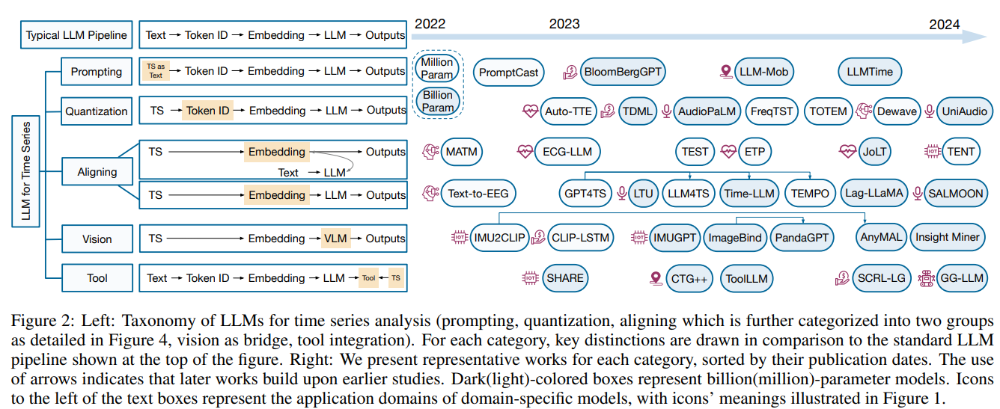

# English
# LLMs for Time Series: A Survey

The authors discuss the potential of Large Language Models (LLMs) for analyzing time series data across various domains such as climate, IoT, healthcare, and finance. This paper highlights the gap between LLMs, originally designed for text data, and the numerical nature of time series data.

It provides a taxonomy of methods to adapt LLMs for time series analysis, including direct prompting, time series quantization, and using vision models as a bridge.

The paper also reviews datasets that combine time series and text, addressing challenges and future research directions in this emerging field.

Traditional methods for time series analysis, like frequency analysis and deep learning approaches (e.g., CNNs, LSTMs, Transformers), have been widely used. However, the advent of Large Language Models (LLMs) has revolutionized areas like natural language processing (NLP) and computer vision (CV). Inspired by this success, researchers are now exploring LLMs for time series analysis. The challenge lies in adapting LLMs, which are designed for discrete text data, to the continuous, numerical nature of time series data.

**Paper link**: [https://arxiv.org/pdf/2402.01801](https://arxiv.org/pdf/2402.01801)

---

## Key Challenges of LLMs in Time Series Analysis

- **Modality Gap**: LLMs are trained on discrete textual data, whereas time series data is continuous and numerical. Bridging this gap is a significant challenge.
- **Continuity and Auto-Regressiveness**: Time series data has properties like continuity and auto-regressiveness, which differ from the static nature of text data.
- **Sampling Rate Dependency**: Time series data relies heavily on the sampling rate, adding complexity in adapting LLMs for such tasks.
- **Cross-Domain Knowledge Transfer**: Effectively transferring knowledge from LLMs, which excel in language-based tasks, to time series analysis is a challenging frontier.

---

## Approaches to Address the Challenges

The taxonomy in the paper proposes several approaches to address the challenges of using LLMs for time series analysis. Here’s a summary of these methods:

- **Prompting**: This approach treats time series data as text, using direct prompts to utilize pre-trained LLMs. It is easy to implement but may lose the semantics tied to numerical data, especially for high precision or multivariate time series. This method is useful for zero-shot tasks but may not be efficient for long-term predictions.

- **Time Series Quantization**: This method discretizes continuous time series data into tokens. By turning continuous data into discrete tokens, the model can process it more effectively, though this may require a two-stage training process (techniques like Vector Quantized-Variational AutoEncoder (VQ-VAE) or K-means clustering are used).

- **Aligning**: In this method, a time series encoder is designed to align time series embeddings with language embeddings, using techniques such as contrastive learning. There are two types of alignment: similarity matching, which aligns embeddings through loss functions, and LLM-backbone methods, where time series data is processed through a large language model with additional fine-tuning.

- **Vision as a Bridge**: This approach leverages visual representations of time series data, transforming the data into a visual format such as graphs or images, which are then processed using vision-language models. This helps bridge the gap between continuous numerical data and LLMs by using existing knowledge from vision models.

- **Tool Integration**: Instead of directly processing time series data, this approach uses LLMs to generate tools, such as code or API calls, to assist in time series-related tasks. For example, an LLM could be used to generate a traffic forecasting tool by creating code from textual descriptions.

---

## Multimodal Datasets

The authors also cited various multimodal time series and text datasets that help apply LLMs for time series. There are different datasets that can be applied to different domains:

- **IoT (Internet of Things)**: Datasets like Ego4D and DeepSQA are used for tasks like human activity recognition by pairing time series data from devices (such as IMU sensors) with textual descriptions.

- **Finance (FOCUS)**: PIXIU presents multi-task and multi-modal instruction tuning data in the financial domain with 136K data samples. It contains both financial natural language understanding and prediction tasks and covers 9 datasets of multiple modalities such as text and time series. MoAT constructs multimodal datasets with textual information paired with time series for each time step, such as news articles extracted with relevant keywords, mostly covering finance-related domains such as fuel, metal, stock, and bitcoin.

- **Healthcare**: Datasets such as Zuco and PTB-XL offer rich multimodal data, such as eye-tracking, EEG, and ECG measurements, paired with text for classification and question-answering tasks.

- **Audio and Music**: Datasets like AudioSet and MusicCaps pair audio data with textual descriptions to support tasks like music captioning, tagging, and classification.

# Türkçe
# Zaman Serileri İçin Büyük Dil Modelleri (LLMs): Bir İnceleme

Yazarlar, Büyük Dil Modellerinin (LLMs) iklim, IoT, sağlık ve finans gibi çeşitli alanlarda zaman serisi verilerini analiz etme potansiyelini tartışmaktadır. LLM'lerin başlangıçta metin verisi için tasarlanmış olmasına karşın, zaman serisi verilerinin sayısal doğasıyla arasındaki farkları vurgulamaktadır.

Makale, zaman serisi analizi için LLM'lerin uyarlanmasına yönelik bir yöntem sınıflandırması sunmakta olup, doğrudan yönlendirme, zaman serisi kuantizasyonu ve görsel modelleri bir köprü olarak kullanma gibi yöntemleri içermektedir.

Ayrıca, zaman serisi ve metni birleştiren veri setlerini inceleyerek bu yeni alanda karşılaşılan zorlukları ve gelecekteki araştırma alanlarını ele almaktadır.

Geleneksel zaman serisi analiz yöntemleri, frekans analizi ve derin öğrenme yaklaşımları (örneğin, CNN'ler, LSTM'ler, Dönüştürücüler) gibi geniş bir kullanım alanına sahiptir. Ancak, Büyük Dil Modellerinin (LLMs) gelişimi, doğal dil işleme (NLP) ve bilgisayarlı görü (CV) gibi alanlarda devrim yaratmıştır. Bu başarıdan ilham alan araştırmacılar, artık LLM'leri zaman serisi analizi için de keşfetmektedir. Zorluk, metin verisi için tasarlanmış olan LLM'leri sürekli ve sayısal yapıya sahip zaman serisi verilerine uyarlamada yatmaktadır.

Makale bağlantısı: https://arxiv.org/pdf/2402.01801

## Zaman Serisi Analizinde LLM'lerin Temel Zorlukları:

- Modallik Farkı: LLM'ler ayrık metin verileriyle eğitilirken, zaman serisi verisi sürekli ve sayısaldır. Bu farkı kapatmak büyük bir zorluktur.
- Süreklilik ve Otoregresiflik: Zaman serisi verisinin süreklilik ve otoregresiflik gibi özellikleri, metin verisinin statik doğasından farklıdır.
- Örnekleme Oranı Bağımlılığı: Zaman serisi verisi büyük ölçüde örnekleme oranına bağlıdır, bu da LLM'leri bu tür görevler için uyarlamayı karmaşık hale getirir.
- Çapraz Alan Bilgi Transferi: Dil tabanlı görevlerde başarılı olan LLM'lerin bilgisini zaman serisi analizine etkili bir şekilde aktarmak zorlu bir alandır.

## Zorlukları Ele Almak İçin Yaklaşımlar:
Makaledeki sınıflandırma, zaman serisi analizinde LLM'lerin kullanım zorluklarını çözmek için birkaç yaklaşım önermektedir. İşte bu yöntemlerin bir özeti:

- Yönlendirme (Prompting): Bu yaklaşım, zaman serisi verisini doğrudan yönlendirmelerle metin gibi ele alır. Önceden eğitilmiş LLM'leri kullanmak kolay olsa da, özellikle yüksek hassasiyetli veya çok değişkenli zaman serileri için sayısal veriye bağlı anlamları kaybetme riski taşır. Bu yöntem sıfırdan görevler için faydalı olsa da uzun vadeli tahminler için verimli olmayabilir.

- Zaman Serisi Kuantizasyonu: Bu yöntem, sürekli zaman serisi verisini ayrık tokenlere dönüştürerek işlemesini sağlar, ancak iki aşamalı bir eğitim süreci gerektirebilir. (Vektör Kuantize-Varyasyonel Otoenkoder (VQ-VAE) veya K-means kümeleme gibi teknikler kullanılır).

- Hizalama (Aligning): Bu yöntemde, bir zaman serisi kodlayıcı, zaman serisi gömülerini dil gömüleri ile hizalamak için kontrastif öğrenme gibi teknikler kullanır. İki tür hizalama vardır: benzerlik eşleştirme, kayıp fonksiyonları ile gömüleri hizalar; LLM-omurga yöntemleri ise zaman serisi verisini ek ince ayarlamalarla büyük bir dil modeli üzerinden işler.

- Görsel Köprü Kullanımı: Bu yaklaşım, zaman serisi verisini grafik veya görüntü gibi görsel bir formata dönüştürerek, görsel-dil modellerini kullanarak işlemesini sağlar. Böylece, sürekli sayısal veri ile LLM'ler arasındaki farkı, görsel modellerden edinilen bilgileri kullanarak kapatır.

- Araç Entegrasyonu: Zaman serisi verisini doğrudan işlemek yerine, bu yaklaşım LLM'leri kod veya API çağrıları gibi araçlar oluşturmak için kullanır. Örneğin, bir LLM, metinsel açıklamalardan trafik tahmin aracı oluşturmak için kod oluşturabilir.

## Çok Modlu Veri Setleri:

Yazarlar ayrıca, LLM'leri zaman serisi için uygulamada yardımcı olan çeşitli çok modlu zaman serisi ve metin veri setlerine de değinmektedir.
Farklı alanlara uygulanabilecek veri setleri bulunmaktadır:

- IoT (Nesnelerin İnterneti): Ego4D ve DeepSQA gibi veri setleri, IMU sensörlerinden gelen zaman serisi verilerini metin açıklamalarıyla eşleştirerek insan aktivitelerinin tanınması gibi görevler için kullanılır.

- Finans (FOCUS): PIXIU, finans alanında çok görevli ve çok modlu eğitim verisi sunar ve 136K veri örneği içerir. Finansal doğal dil anlama ve tahmin görevlerini içermekte olup, metin ve zaman serisi gibi birden çok modda veriyi kapsar. MoAT, zaman serisine her bir zaman dilimi için haber makaleleri ve ilgili anahtar kelimeler gibi metin bilgileri ekleyerek çok modlu veri setleri oluşturmaktadır ve bu veriler çoğunlukla yakıt, metal, hisse senedi ve bitcoin gibi finansla ilgili alanları kapsamaktadır.

- Sağlık: Zuco ve PTB-XL gibi veri setleri, sınıflandırma ve soru yanıtlama görevleri için metinle eşleştirilen göz izleme, EEG ve EKG ölçümleri gibi zengin çok modlu veriler sunar.

- Ses ve Müzik: AudioSet ve MusicCaps gibi veri setleri, ses verilerini müzik altyazıları, etiketleme ve sınıflandırma gibi görevleri desteklemek için metin açıklamalarıyla eşleştirir.
