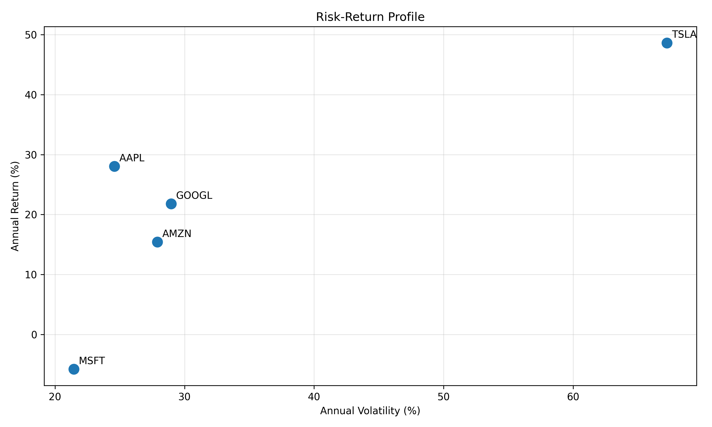
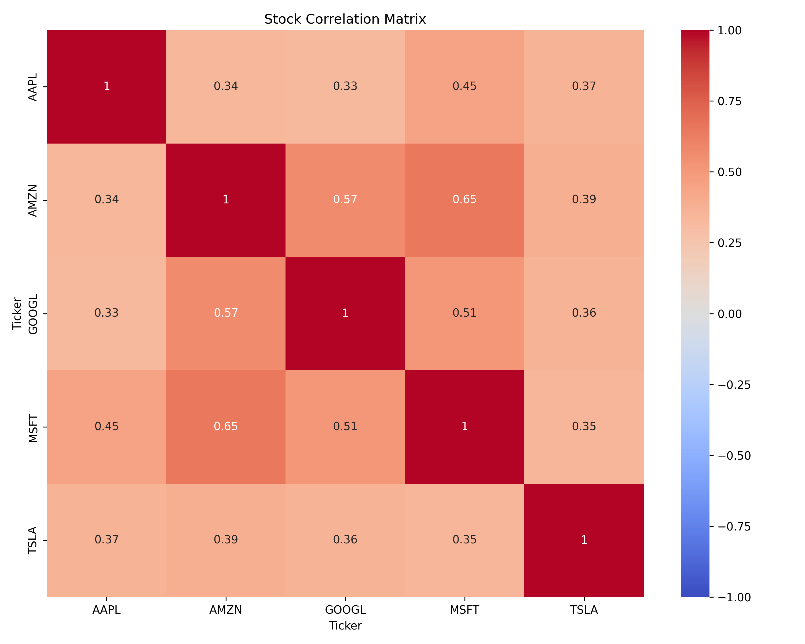

# 🤖 Multi-Agent Detailed Financial System

<div align="center">
  
  <p><em>AI-powered collaborative financial analysis</em></p>
  
  
  
  

## 📊 Overview

FinAgents is an advanced financial portfolio analysis system that leverages multiple specialized AI agents to deliver comprehensive investment insights. By simulating a team of financial professionals, each with their own expertise, the system provides:

- 📈 Detailed risk assessments and mitigation strategies
- 🌎 In-depth market analyses and sector-specific recommendations
- 📊 Data-driven portfolio optimization and allocation recommendations
- 💼 Actionable implementation strategies with specific timelines
- 📝 Comprehensive investment reports with visualizations

## 📑 Table of Contents

- [Features](#-features)
- [Architecture](#-architecture)
- [How Multi-Agent Systems Work](#-how-multi-agent-systems-work)
- [Agents in This System](#-agents-in-this-system)
- [Agent Communication Flow](#-agent-communication-flow)
- [Implementation Details](#%EF%B8%8F-implementation-details)
- [Example Agent Outputs](#-example-agent-outputs)
- [Getting Started](#-getting-started)
- [Usage](#-usage)
- [Customization](#-customization)
- [Project Structure](#-project-structure)
- [Conclusion](#-conclusion)
- [Turkish | Türkçe](#-turkish--türkçe)

## ✨ Features

- **Multi-Agent Collaboration**: Specialized agents work together to analyze financial data from multiple perspectives
- **Comprehensive Portfolio Analysis**: Deep dive into risks, returns, and optimization opportunities
- **Data-Driven Insights**: Analysis based on real market data using yfinance, pandas, and numpy
- **Professional Visualizations**: Automated generation of key portfolio charts and metrics
- **PDF Reporting**: Complete investment reports in a professional format

## 🏗️ Architecture

FinAgents employs a modular architecture that separates concerns into clear domains:

```
FinAgents/
├── models/          # Core data models and agent definitions
├── visualization/   # Charting and data visualization
├── reporting/       # PDF report generation capabilities
├── utils/           # Helper functions and utilities
└── main.py          # Main application entry point
```

## 🧠 How Multi-Agent Systems Work

Multi-agent systems (MAS) represent a paradigm shift in AI applications, where multiple specialized AI agents collaborate to tackle complex problems. Each agent contributes unique expertise to the collective intelligence.

<div align="center">
  <table>
    <tr>
      <th>Component</th>
      <th>Description</th>
    </tr>
    <tr>
      <td><b>Specialized Roles</b></td>
      <td>Each agent has specific expertise and objectives</td>
    </tr>
    <tr>
      <td><b>Unique Perspectives</b></td>
      <td>Agents approach problems from different angles</td>
    </tr>
    <tr>
      <td><b>Collaborative Problem-Solving</b></td>
      <td>Agents build upon each other's insights</td>
    </tr>
    <tr>
      <td><b>Emergent Intelligence</b></td>
      <td>The collective output exceeds individual capabilities</td>
    </tr>
  </table>
</div>

### Key Components of Agent Architecture

Each agent in the system is designed with:

1. **Role Definition**: Clear description of the agent's specialized function
2. **Goal Setting**: Specific objectives the agent aims to achieve
3. **Backstory/Context**: Background information that shapes the agent's perspective
4. **Task Assignment**: Specific instructions for what the agent needs to accomplish
5. **Communication Channels**: Methods for agents to share information

## 👥 Agents in This System

FinAgents implements a collaborative team of five specialized financial AI agents, each with distinct expertise and responsibilities:

<div align="center">
  <table>
    <tr>
      <th>Agent</th>
      <th>Role & Expertise</th>
      <th>Responsibilities</th>
    </tr>
    <tr>
      <td><b>📈 Risk Analyst</b></td>
      <td>Risk assessment specialist with expertise in quantitative strategies and multi-asset portfolio construction</td>
      <td>
        • Evaluates portfolio volatility<br>
        • Identifies correlation risks<br>
        • Suggests risk mitigation strategies<br>
        • Recommends diversification approaches
      </td>
    </tr>
    <tr>
      <td><b>🌎 Market Analyst</b></td>
      <td>Market trends expert with knowledge of macroeconomics, sector analysis, and stock selection</td>
      <td>
        • Analyzes market conditions<br>
        • Provides sector-specific insights<br>
        • Identifies emerging opportunities<br>
        • Recommends specific securities
      </td>
    </tr>
    <tr>
      <td><b>📊 Allocation Optimizer</b></td>
      <td>Portfolio optimization specialist using modern portfolio theory and quantitative finance</td>
      <td>
        • Optimizes asset allocation<br>
        • Maximizes risk-adjusted returns<br>
        • Balances risk and return<br>
        • Proposes specific allocation percentages
      </td>
    </tr>
    <tr>
      <td><b>💼 Portfolio Manager</b></td>
      <td>Decision maker with expertise in asset allocation, security selection, and implementation</td>
      <td>
        • Makes final allocation decisions<br>
        • Considers tax implications<br>
        • Creates implementation timelines<br>
        • Develops monitoring strategies
      </td>
    </tr>
    <tr>
      <td><b>📝 Report Generator</b></td>
      <td>Financial communication expert specializing in report writing and client communication</td>
      <td>
        • Creates comprehensive reports<br>
        • Translates complex analyses<br>
        • Structures clear recommendations<br>
        • Generates professional documentation
      </td>
    </tr>
  </table>
</div>

## 🔄 Agent Communication Flow

The agent collaboration in FinAgents follows a structured workflow that mimics a professional financial team:

<div align="center">
  
  <p><em>Visual representation of agent communication and information flow</em></p>
</div>

### Collaborative Process:

1. **Initial Analysis**: The Risk Analyst and Market Analyst work independently to evaluate portfolio risks and market conditions
2. **Insight Sharing**: Both analysts feed their specialized insights to the Allocation Optimizer
3. **Optimization**: The Allocation Optimizer processes this information to propose optimal portfolio adjustments
4. **Executive Decision**: The Portfolio Manager reviews all recommendations and formulates the final strategy
5. **Documentation**: The Report Generator compiles all insights into a comprehensive client-ready report
6. **Cross-Communication**: Direct information sharing between analysts and the report generator ensures all critical information is captured

This multi-perspective approach creates a comprehensive analysis that benefits from diverse expertise while maintaining a coherent investment strategy.

## ⚙️ Implementation Details

FinAgents is built using modern AI and data science technologies:

<div align="center">
  <table>
    <tr>
      <th>Component</th>
      <th>Technology</th>
      <th>Purpose</th>
    </tr>
    <tr>
      <td>Agent Orchestration</td>
      <td><b>CrewAI</b></td>
      <td>Framework for creating and managing specialized AI agents</td>
    </tr>
    <tr>
      <td>AI Integration</td>
      <td><b>LangChain</b></td>
      <td>Connects language models to external tools and data</td>
    </tr>
    <tr>
      <td>Intelligence Layer</td>
      <td><b>OpenAI GPT-4o</b></td>
      <td>Powers the reasoning and analysis capabilities of agents</td>
    </tr>
    <tr>
      <td>Data Processing</td>
      <td><b>yfinance, pandas, numpy</b></td>
      <td>Financial data retrieval and numerical analysis</td>
    </tr>
    <tr>
      <td>Visualization</td>
      <td><b>Matplotlib, seaborn</b></td>
      <td>Creating professional charts and visualizations</td>
    </tr>
    <tr>
      <td>Reporting</td>
      <td><b>FPDF</b></td>
      <td>Generating comprehensive PDF reports</td>
    </tr>
  </table>
</div>


## 💬 Example Agent Outputs

<details open>
  <summary><b>📈 Risk Analyst Output</b></summary>
  <blockquote>
    <p>Identified risks include high volatility, sector concentration, and market-specific risks. Mitigation strategies involve diversifying across asset classes, sectors, and geographic regions. Introducing bonds, REITs, and commodities will reduce volatility, while international equities and factor-based strategies will enhance diversification.</p>
    <p>Specific recommendations include adding AGG for fixed income exposure, VNQ for real estate diversification, and GLD for inflation hedging. Additionally, introducing ACWX would reduce geographic concentration risk.</p>
  </blockquote>
</details>

<details>
  <summary><b>🌎 Market Analyst Output</b></summary>
  <blockquote>
    <p>Current market conditions are characterized by volatility and sector-specific risks, particularly in technology and consumer discretionary sectors. The technology sector faces regulatory scrutiny and supply chain disruptions, while consumer discretionary is impacted by inflation and supply chain issues.</p>
    <p>To mitigate these risks, diversification into healthcare (JNJ, PFE, MRNA), financials (JPM, GS, V), and industrials (GE, CAT, HON) is recommended. These sectors show resilience in current economic conditions and provide exposure to different growth drivers.</p>
  </blockquote>
</details>

<details>
  <summary><b>📊 Allocation Optimizer Output</b></summary>
  <blockquote>
    <p>The revised portfolio allocation includes:</p>
    <table>
      <tr>
        <th>Asset Category</th>
        <th>Ticker</th>
        <th>Allocation</th>
      </tr>
      <tr>
        <td rowspan="5">Technology</td>
        <td>AAPL</td>
        <td>12%</td>
      </tr>
      <tr>
        <td>MSFT</td>
        <td>12%</td>
      </tr>
      <tr>
        <td>GOOGL</td>
        <td>8%</td>
      </tr>
      <tr>
        <td>AMZN</td>
        <td>8%</td>
      </tr>
      <tr>
        <td>TSLA</td>
        <td>4%</td>
      </tr>
      <tr>
        <td rowspan="3">Alternative Assets</td>
        <td>AGG (Bonds)</td>
        <td>12%</td>
      </tr>
      <tr>
        <td>VNQ (REITs)</td>
        <td>8%</td>
      </tr>
      <tr>
        <td>GLD (Commodities)</td>
        <td>4%</td>
      </tr>
      <tr>
        <td>International</td>
        <td>ACWX</td>
        <td>8%</td>
      </tr>
      <tr>
        <td rowspan="2">Factor-Based</td>
        <td>VLUE (Value)</td>
        <td>4%</td>
      </tr>
      <tr>
        <td>QUAL (Quality)</td>
        <td>4%</td>
      </tr>
      <tr>
        <td>Healthcare</td>
        <td>JNJ, PFE, MRNA</td>
        <td>5.5%</td>
      </tr>
      <tr>
        <td>Financials</td>
        <td>JPM, GS, V</td>
        <td>5.5%</td>
      </tr>
      <tr>
        <td>Industrials</td>
        <td>GE, CAT, HON</td>
        <td>5%</td>
      </tr>
    </table>
    <p>This balanced allocation totals exactly 100% while maintaining diversification across technology stocks, fixed income, real estate, commodities, international exposure, factor-based investments, and sector-specific stocks.</p>
  </blockquote>
</details>

<details>
  <summary><b>💼 Portfolio Manager Output</b></summary>
  <blockquote>
    <p><strong>Implementation Strategy:</strong></p>
    <ol>
      <li><strong>Immediate (0-3 months):</strong> Rebalance technology and consumer discretionary holdings. Initiate positions in AGG, VNQ, GLD, and ACWX.</li>
      <li><strong>Short-Term (3-6 months):</strong> Introduce healthcare, financials, and industrials stocks gradually to reduce timing risk.</li>
      <li><strong>Medium-Term (6-9 months):</strong> Evaluate factor-based ETFs and adjust allocations based on market conditions.</li>
      <li><strong>Long-Term (9-12 months):</strong> Complete full portfolio transition and conduct comprehensive performance review.</li>
    </ol>
    <p>This phased approach minimizes transaction costs and tax implications while systematically improving portfolio diversification.</p>
  </blockquote>
</details>

<div align="center">
  
  
  <p><em>Sample visualizations generated by the system</em></p>
</div>

## 🚀 Getting Started

### Prerequisites

- Python 3.8 or higher
- OpenAI API key
- Graphviz (for workflow diagram generation)

### Installation

```bash
# Clone the repository
git clone https://github.com/serkannpolatt/FinAgents.git
cd FinAgents

# Create and activate virtual environment (optional but recommended)
python -m venv venv
source venv/bin/activate  # On Windows: venv\Scripts\activate

# Install dependencies
pip install -r requirements.txt

# Create .env file for API key
echo OPENAI_API_KEY=your_api_key_here > .env
```

## 🔧 Usage

```bash
# Run the application with default portfolio
python main.py

# Review the generated outputs
# - PDF report: Portfolio_Investment_Report_[DATE].pdf
# - Chart directory: charts/
# - Workflow diagram: workflow.png
```

## 🛠️ Customization

You can customize the portfolio by modifying the `DEFAULT_PORTFOLIO` in `utils/config.py`:

```python
DEFAULT_PORTFOLIO = {
    "AAPL": {"weight": 0.25},
    "MSFT": {"weight": 0.25},
    # Add more stocks with their weights
}
```

Or by passing a custom portfolio directly to the main function:

```python
from main import main

custom_portfolio = {
    "TSLA": {"weight": 0.30},
    "NVDA": {"weight": 0.30},
    "AMZN": {"weight": 0.40}
}

main(custom_portfolio)
```

## 📂 Project Structure

```
FinAgents/
├── models/              # Core functionality
│   ├── agents.py        # Agent and task definitions
│   ├── data.py          # Data retrieval functions
│   └── metrics.py       # Portfolio metric calculations
├── visualization/       # Data visualization
│   └── charts.py        # Chart generation functions
├── reporting/           # Report generation
│   └── pdf_report.py    # PDF creation functionality
├── utils/               # Utilities
│   ├── config.py        # Configuration settings
│   ├── helpers.py       # Helper functions
│   └── validation.py    # Allocation validation
├── main.py              # Main application entry point
└── requirements.txt     # Project dependencies
```


## 🏁 Conclusion

FinAgents demonstrates the power of multi-agent AI systems in financial analysis. By simulating a team of specialized financial experts, it provides comprehensive portfolio insights that would traditionally require multiple human analysts.

The modular design makes it easy to extend with additional agents, improve existing analysis techniques, or adapt to different financial markets and instruments.

---

## 🇹🇷 Turkish | Türkçe

<div align="center">
  <h3>Çoklu-Ajan Detaylı Finansal Sistem</h3>
  <p><em>Yapay zeka destekli işbirlikçi finansal analiz</em></p>
  
  
  
  
  
</div>

## 📑 İçindekiler

- [Özellikler](#-özellikler)
- [Mimari](#-mimari)
- [Çoklu Ajan Sistemleri Nasıl Çalışır](#-çoklu-ajan-sistemleri-nasıl-çalışır)
- [Sistemdeki Ajanlar](#-sistemdeki-ajanlar)
- [Ajan İletişim Akışı](#-ajan-iletişim-akışı)
- [Uygulama Detayları](#%EF%B8%8F-uygulama-detayları)
- [Örnek Ajan Çıktıları](#-örnek-ajan-çıktıları)
- [Başlangıç](#-başlangıç)
- [Kullanım](#-kullanım)
- [Özelleştirme](#%EF%B8%8F-özelleştirme)
- [Proje Yapısı](#-proje-yapısı)
- [Sonuç](#-sonuç)

### 📊 Genel Bakış

FinAgents, kapsamlı yatırım analizleri sunmak için özelleştirilmiş yapay zeka ajanlarını kullanan gelişmiş bir finansal portföy analiz sistemidir. Her biri kendi uzmanlık alanına sahip bir finansal uzmanlar ekibini simüle ederek, sistem şunları sağlar:

- 📈 Detaylı risk değerlendirmeleri ve risk azaltma stratejileri
- 🌎 Derinlemesine piyasa analizleri ve sektöre özel tavsiyeler
- 📊 Veri odaklı portföy optimizasyonu ve tahsis önerileri
- 💼 Belirli zaman çizelgeleriyle uygulanabilir stratejiler
- 📝 Görselleştirmelerle kapsamlı yatırım raporları

### ✨ Özellikler

- **Çoklu Ajan İşbirliği**: Özelleştirilmiş ajanlar, finansal verileri farklı perspektiflerden analiz etmek için birlikte çalışır
- **Kapsamlı Portföy Analizi**: Risk, getiri ve optimizasyon fırsatlarına derinlemesine inceleme
- **Veri Odaklı İçgörüler**: yfinance, pandas ve numpy kullanarak gerçek piyasa verilerine dayalı analiz
- **Profesyonel Görselleştirmeler**: Temel portföy grafiklerinin ve metriklerinin otomatik oluşturulması
- **PDF Raporlama**: Profesyonel formatta kapsamlı yatırım raporları

### 🧠 Çoklu Ajan Sistemleri Nasıl Çalışır

Çoklu ajan sistemleri (MAS), tek bir ajana zor veya imkansız gelen problemleri çözmek için birden fazla yapay zeka ajanının etkileşimde bulunduğu hesaplama sistemleridir. Her ajan kolektif zekaya benzersiz uzmanlığını katar.

<div align="center">
  <table>
    <tr>
      <th>Bileşen</th>
      <th>Açıklama</th>
    </tr>
    <tr>
      <td><b>Özelleştirilmiş Roller</b></td>
      <td>Her ajanın belirli uzmanlık ve hedefleri vardır</td>
    </tr>
    <tr>
      <td><b>Benzersiz Perspektifler</b></td>
      <td>Ajanlar problemlere farklı açılardan yaklaşır</td>
    </tr>
    <tr>
      <td><b>İşbirlikçi Problem Çözme</b></td>
      <td>Ajanlar birbirlerinin içgörüleri üzerine inşa ederler</td>
    </tr>
    <tr>
      <td><b>Ortaya Çıkan Zeka</b></td>
      <td>Kolektif çıktı, bireysel kapasiteleri aşar</td>
    </tr>
  </table>
</div>

### Ajan Mimarisinin Temel Bileşenleri

Sistemdeki her ajan şunlarla tasarlanmıştır:

1. **Rol Tanımı**: Ajanın özelleştirilmiş işlevinin net açıklaması
2. **Hedef Belirleme**: Ajanın ulaşmayı amaçladığı belirli hedefler
3. **Geçmiş/Bağlam**: Ajanın perspektifini şekillendiren arka plan bilgisi
4. **Görev Ataması**: Ajanın yapması gereken şey için belirli talimatlar
5. **İletişim Kanalları**: Ajanların bilgi paylaşma yöntemleri

### 🏗️ Mimari

FinAgents, endişeleri net alanlara ayıran modüler bir mimariye sahiptir:

```
FinAgents/
├── models/          # Temel veri modelleri ve ajan tanımları
├── visualization/   # Grafik ve veri görselleştirme
├── reporting/       # PDF rapor oluşturma yetenekleri
├── utils/           # Yardımcı fonksiyonlar ve araçlar
└── main.py          # Ana uygulama giriş noktası
```

### 👥 Sistemdeki Ajanlar

FinAgents, her biri farklı uzmanlığa ve sorumluluklara sahip beş özelleştirilmiş finansal yapay zeka ajanı içeren işbirlikçi bir ekip uygulamaktadır:

<div align="center">
  <table>
    <tr>
      <th>Ajan</th>
      <th>Rol ve Uzmanlık</th>
      <th>Sorumluluklar</th>
    </tr>
    <tr>
      <td><b>📈 Risk Analisti</b></td>
      <td>Nicel stratejiler ve çoklu varlık portföy oluşturma konusunda uzmanlığa sahip risk değerlendirme uzmanı</td>
      <td>
        • Portföy volatilitesini değerlendirir<br>
        • Korelasyon risklerini tanımlar<br>
        • Risk azaltma stratejileri önerir<br>
        • Çeşitlendirme yaklaşımları tavsiye eder
      </td>
    </tr>
    <tr>
      <td><b>🌎 Piyasa Analisti</b></td>
      <td>Makroekonomi, sektör analizi ve hisse senedi seçimi konusunda bilgi sahibi piyasa trendleri uzmanı</td>
      <td>
        • Piyasa koşullarını analiz eder<br>
        • Sektöre özel içgörüler sağlar<br>
        • Yeni fırsatları belirler<br>
        • Belirli menkul kıymetler önerir
      </td>
    </tr>
    <tr>
      <td><b>📊 Tahsis Optimize Edicisi</b></td>
      <td>Modern portföy teorisi ve nicel finans kullanan portföy optimizasyon uzmanı</td>
      <td>
        • Varlık tahsisini optimize eder<br>
        • Riske göre ayarlanmış getirileri maksimize eder<br>
        • Risk ve getiriyi dengeler<br>
        • Belirli tahsis yüzdeleri önerir
      </td>
    </tr>
    <tr>
      <td><b>💼 Portföy Yöneticisi</b></td>
      <td>Varlık tahsisi, menkul kıymet seçimi ve uygulama konularında uzmanlığa sahip karar verici</td>
      <td>
        • Nihai tahsis kararlarını verir<br>
        • Vergi etkilerini dikkate alır<br>
        • Uygulama zaman çizelgeleri oluşturur<br>
        • İzleme stratejileri geliştirir
      </td>
    </tr>
    <tr>
      <td><b>📝 Rapor Oluşturucusu</b></td>
      <td>Rapor yazımı ve müşteri iletişiminde uzmanlaşmış finansal iletişim uzmanı</td>
      <td>
        • Kapsamlı raporlar oluşturur<br>
        • Karmaşık analizleri çevirir<br>
        • Net öneriler yapılandırır<br>
        • Profesyonel dokümantasyon üretir
      </td>
    </tr>
  </table>
</div>

### 🔄 Ajan İletişim Akışı

FinAgents'taki ajan işbirliği, profesyonel bir finansal ekibi taklit eden yapılandırılmış bir iş akışını takip eder:

<div align="center">
  
  <p><em>Ajan iletişimi ve bilgi akışının görsel temsili</em></p>
</div>

### İşbirlikçi Süreç:

1. **İlk Analiz**: Risk Analisti ve Piyasa Analisti, portföy risklerini ve piyasa koşullarını değerlendirmek için bağımsız çalışır
2. **İçgörü Paylaşımı**: Her iki analist de özelleştirilmiş içgörülerini Tahsis Optimize Edicisine iletir
3. **Optimizasyon**: Tahsis Optimize Edicisi, en uygun portföy ayarlamalarını önermek için bu bilgileri işler
4. **Yönetici Kararı**: Portföy Yöneticisi tüm tavsiyeleri inceler ve nihai stratejiyi formüle eder
5. **Dokümantasyon**: Rapor Oluşturucusu tüm içgörüleri kapsamlı ve müşteriye hazır bir raporda bir araya getirir
6. **Çapraz İletişim**: Analistler ve rapor oluşturucusu arasındaki doğrudan bilgi paylaşımı, tüm kritik bilgilerin yakalanmasını sağlar

Bu çok perspektifli yaklaşım, tutarlı bir yatırım stratejisini korurken çeşitli uzmanlıklardan yararlanan kapsamlı bir analiz oluşturur.

### ⚙️ Uygulama Detayları

FinAgents, modern yapay zeka ve veri bilimi teknolojileri kullanılarak oluşturulmuştur:

<div align="center">
  <table>
    <tr>
      <th>Bileşen</th>
      <th>Teknoloji</th>
      <th>Amaç</th>
    </tr>
    <tr>
      <td>Ajan Orkestrayonu</td>
      <td><b>CrewAI</b></td>
      <td>Özelleştirilmiş yapay zeka ajanlarını oluşturma ve yönetme çerçevesi</td>
    </tr>
    <tr>
      <td>Yapay Zeka Entegrasyonu</td>
      <td><b>LangChain</b></td>
      <td>Dil modellerini harici araçlara ve verilere bağlar</td>
    </tr>
    <tr>
      <td>Zeka Katmanı</td>
      <td><b>OpenAI GPT-4o</b></td>
      <td>Ajanların akıl yürütme ve analiz yeteneklerini güçlendirir</td>
    </tr>
    <tr>
      <td>Veri İşleme</td>
      <td><b>yfinance, pandas, numpy</b></td>
      <td>Finansal veri alma ve sayısal analiz</td>
    </tr>
    <tr>
      <td>Görselleştirme</td>
      <td><b>Matplotlib, seaborn</b></td>
      <td>Profesyonel grafikler ve görselleştirmeler oluşturma</td>
    </tr>
    <tr>
      <td>Raporlama</td>
      <td><b>FPDF</b></td>
      <td>Kapsamlı PDF raporları oluşturma</td>
    </tr>
  </table>
</div>


### 💬 Örnek Ajan Çıktıları

<details open>
  <summary><b>📈 Risk Analisti Çıktısı</b></summary>
  <blockquote>
    <p>Tanımlanan riskler yüksek volatilite, sektör yoğunlaşması ve piyasaya özgü riskleri içermektedir. Risk azaltma stratejileri varlık sınıfları, sektörler ve coğrafi bölgeler arasında çeşitlendirmeyi içerir. Tahviller (AGG), GYO'lar (VNQ) ve emtialar (GLD) eklenmesi volatiliteyi azaltırken, uluslararası hisse senetleri ve faktör bazlı stratejiler çeşitlendirmeyi artıracaktır.</p>
    <p>Belirli tavsiyeler arasında sabit getirili varlıklar için AGG, gayrimenkul çeşitliliği için VNQ ve enflasyon koruması için GLD eklenmesi yer alıyor. Ayrıca, ACWX'in eklenmesi coğrafi yoğunlaşma riskini azaltacaktır.</p>
  </blockquote>
</details>

<details>
  <summary><b>🌎 Piyasa Analisti Çıktısı</b></summary>
  <blockquote>
    <p>Mevcut piyasa koşulları, özellikle teknoloji ve tüketici isteğine bağlı sektörlerde volatilite ve sektöre özgü risklerle karakterizedir. Teknoloji sektörü düzenleyici inceleme ve tedarik zinciri kesintileriyle karşı karşıyayken, tüketici isteğine bağlı sektör enflasyon ve tedarik zinciri sorunlarından etkilenmektedir.</p>
    <p>Bu riskleri azaltmak için, sağlık (JNJ, PFE, MRNA), finans (JPM, GS, V) ve sanayi (GE, CAT, HON) sektörlerine çeşitlendirme önerilmektedir. Bu sektörler mevcut ekonomik koşullarda dayanıklılık göstermekte ve farklı büyüme faktörlerine maruz kalma sağlamaktadır.</p>
  </blockquote>
</details>

<details>
  <summary><b>📊 Tahsis Optimize Edicisi Çıktısı</b></summary>
  <blockquote>
    <p>Revize edilmiş portföy tahsisi şunları içerir:</p>
    <table>
      <tr>
        <th>Varlık Kategorisi</th>
        <th>Sembol</th>
        <th>Tahsis</th>
      </tr>
      <tr>
        <td rowspan="5">Teknoloji</td>
        <td>AAPL</td>
        <td>12%</td>
      </tr>
      <tr>
        <td>MSFT</td>
        <td>12%</td>
      </tr>
      <tr>
        <td>GOOGL</td>
        <td>8%</td>
      </tr>
      <tr>
        <td>AMZN</td>
        <td>8%</td>
      </tr>
      <tr>
        <td>TSLA</td>
        <td>4%</td>
      </tr>
      <tr>
        <td rowspan="3">Alternatif Varlıklar</td>
        <td>AGG (Tahviller)</td>
        <td>12%</td>
      </tr>
      <tr>
        <td>VNQ (GYO'lar)</td>
        <td>8%</td>
      </tr>
      <tr>
        <td>GLD (Emtialar)</td>
        <td>4%</td>
      </tr>
      <tr>
        <td>Uluslararası</td>
        <td>ACWX</td>
        <td>8%</td>
      </tr>
      <tr>
        <td rowspan="2">Faktör Bazlı</td>
        <td>VLUE (Değer)</td>
        <td>4%</td>
      </tr>
      <tr>
        <td>QUAL (Kalite)</td>
        <td>4%</td>
      </tr>
      <tr>
        <td>Sağlık</td>
        <td>JNJ, PFE, MRNA</td>
        <td>5.5%</td>
      </tr>
      <tr>
        <td>Finansal</td>
        <td>JPM, GS, V</td>
        <td>5.5%</td>
      </tr>
      <tr>
        <td>Sanayi</td>
        <td>GE, CAT, HON</td>
        <td>5%</td>
      </tr>
    </table>
    <p>Bu dengeli tahsis, teknoloji hisseleri, sabit getirili varlıklar, gayrimenkul, emtialar, uluslararası maruz kalma, faktör bazlı yatırımlar ve sektöre özgü hisseler arasında çeşitlendirmeyi korurken tam olarak %100'e ulaşır.</p>
  </blockquote>
</details>

<details>
  <summary><b>💼 Portföy Yöneticisi Çıktısı</b></summary>
  <blockquote>
    <p><strong>Uygulama Stratejisi:</strong></p>
    <ol>
      <li><strong>Acil (0-3 ay):</strong> Teknoloji ve tüketici isteğine bağlı hisseleri yeniden dengeleyin. AGG, VNQ, GLD ve ACWX pozisyonlarını başlatın.</li>
      <li><strong>Kısa Vadeli (3-6 ay):</strong> Zamanlama riskini azaltmak için sağlık, finansal ve sanayi hisselerini kademeli olarak ekleyin.</li>
      <li><strong>Orta Vadeli (6-9 ay):</strong> Faktör bazlı ETF'leri değerlendirin ve piyasa koşullarına göre tahsisleri ayarlayın.</li>
      <li><strong>Uzun Vadeli (9-12 ay):</strong> Tam portföy geçişini tamamlayın ve kapsamlı performans değerlendirmesi yapın.</li>
    </ol>
    <p>Bu aşamalı yaklaşım, portföy çeşitlendirmesini sistematik olarak iyileştirirken işlem maliyetlerini ve vergi etkilerini en aza indirir.</p>
  </blockquote>
</details>

<div align="center">
  
  
  <p><em>Sistem tarafından oluşturulan örnek görselleştirmeler</em></p>
</div>

### 🚀 Başlangıç

#### Önkoşullar

- Python 3.8 veya daha yüksek sürümü
- OpenAI API anahtarı
- Graphviz (iş akışı diyagramı oluşturmak için)

#### Kurulum

```bash
# Depoyu klonlayın
git clone https://github.com/serkannpolatt/FinAgents.git
cd FinAgents

# Sanal ortam oluşturun ve etkinleştirin (isteğe bağlı ancak önerilir)
python -m venv venv
venv\Scripts\activate  # Windows için

# Bağımlılıkları yükleyin
pip install -r requirements.txt

# API anahtarı için .env dosyası oluşturun
echo OPENAI_API_KEY=api_anahtarınız > .env
```

### 🔧 Kullanım

```bash
# Uygulamayı varsayılan portföy ile çalıştırın
python main.py

# Oluşturulan çıktıları inceleyin
# - PDF raporu: Portfolio_Investment_Report_[TARİH].pdf
# - Grafik dizini: charts/
# - İş akışı diyagramı: workflow.png
```

### 🛠️ Özelleştirme

Portföyü `utils/config.py` dosyasındaki `DEFAULT_PORTFOLIO` değiştirerek özelleştirebilirsiniz:

```python
DEFAULT_PORTFOLIO = {
    "AAPL": {"weight": 0.25},
    "MSFT": {"weight": 0.25},
    # Daha fazla hisse senedi ve ağırlıkları ekleyin
}
```

Veya özel bir portföyü doğrudan ana fonksiyona ileterek:

```python
from main import main

ozel_portfoy = {
    "TSLA": {"weight": 0.30},
    "NVDA": {"weight": 0.30},
    "AMZN": {"weight": 0.40}
}

main(ozel_portfoy)
```

### 📂 Proje Yapısı

```
FinAgents/
├── models/              # Temel işlevsellik
│   ├── __init__.py      # Paket tanımlama dosyası
│   ├── agents.py        # Ajan ve görev tanımları
│   ├── data.py          # Veri alma fonksiyonları
│   └── metrics.py       # Portföy metrik hesaplamaları
├── visualization/       # Veri görselleştirme
│   ├── __init__.py      # Paket tanımlama dosyası
│   └── charts.py        # Grafik oluşturma fonksiyonları
├── reporting/           # Rapor oluşturma
│   ├── __init__.py      # Paket tanımlama dosyası
│   └── pdf_report.py    # PDF oluşturma işlevselliği
├── utils/               # Yardımcı araçlar
│   ├── __init__.py      # Paket tanımlama dosyası
│   ├── config.py        # Yapılandırma ayarları
│   ├── helpers.py       # Yardımcı fonksiyonlar
│   └── validation.py    # Tahsis doğrulama
├── main.py              # Ana uygulama giriş noktası
├── __init__.py          # Ana paket tanımlama dosyası
├── requirements.txt     # Proje bağımlılıkları
└── README.md            # Proje dokümantasyonu
```

Her bir modül şu görevleri yerine getirir:

1. **models/**: Projenin çekirdek veri yapılarını ve ajan tanımlarını içerir.
   - `agents.py`: Tüm yapay zeka ajanlarını ve görevlerini tanımlar.
   - `data.py`: Hisse senedi verilerinin alınması için fonksiyonlar içerir.
   - `metrics.py`: Portföy metrikleri (getiri, risk, Sharpe oranı vb.) hesaplama mantığını içerir.

2. **visualization/**: Veri görselleştirme işlevlerini içerir.
   - `charts.py`: Korelasyon matrisi, risk-getiri grafikleri, ve diğer çeşitli görsel çıktıları oluşturur.

3. **reporting/**: Rapor oluşturma yeteneklerini içerir.
   - `pdf_report.py`: Kapsamlı yatırım raporları oluşturmak için PDF oluşturma işlevlerini barındırır.

4. **utils/**: Yardımcı fonksiyonlar ve araçlar içerir.
   - `config.py`: Sistem ve proje ile ilgili yapılandırma değişkenlerini ve varsayılan ayarları içerir.
   - `helpers.py`: Çeşitli yardımcı fonksiyonlar ve yardımcı araçları içerir.
   - `validation.py`: Portföy tahsislerini ve diğer kullanıcı girdilerini doğrulama işlevlerini içerir.

5. **main.py**: Uygulamanın ana giriş noktasıdır, tüm bileşenleri birleştirir ve çalışma akışını koordine eder.

### 🏁 Sonuç

FinAgents, finansal analizde çoklu ajan yapay zeka sistemlerinin gücünü göstermektedir. Uzmanlaşmış finansal uzmanlardan oluşan bir ekibi simüle ederek, geleneksel olarak birden fazla insan analistinin gerektirecek kapsamlı portföy öngörüleri sağlar.

Modüler tasarım, ek ajanlarla genişletilmesi, mevcut analiz tekniklerinin geliştirilmesi veya farklı finansal piyasalara ve enstrümanlara adapte edilmesi kolaydır.

